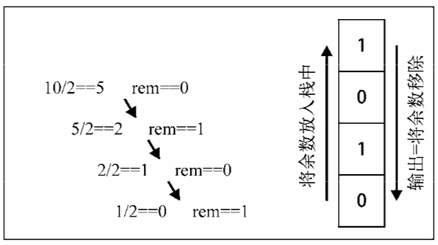

一种遵从先进后出 (LIFO) 原则的有序集合；新添加的或待删除的元素都保存在栈的末尾，称作栈顶，另一端为栈底。在栈里，新元素都靠近栈顶，旧元素都接近栈底。相关的例子就是餐厅推放的盘子

```js
function Stack(){
    // 用let创建一个私有容器，无法用this选择到dataStore；
    let dataStore = [];
    // 模拟进栈的方法 
    this.push = function(element){
        dataStore.push(element);
    };
    // 模拟出栈的方法，返回值是出栈的元素。
    this.pop = function(){
        return dataStore.pop();
    };
    // 返回栈顶元素
    this.peek = function(){
        return dataStore[dataStore.length-1];  
    };
    // 是否为空栈
    this.isEmpty = function(){
        return dataStore.length === 0 
    };
    // 获取栈结构的长度。
    this.size = function(){
        return dataStore.length;
    };
    //  清除栈结构内的所有元素。
    this.clear = function(){
        dataStore = [];
    }
}

let stack = new Stack();
stack.push(1);
stack.push(2);
stack.push(5);
stack.peek(); // return 5
stack.size(); // return 3
stack.clear();
stack.peek(); // undefined
5/2 === 2 ----1
2/2 === 1 ----0
1/2 === 0 ----1

6/2 === 3 ---0
3/2 === 1 ---1
1/2 === 0 ---1
```
### 运用场景
#### 十进制转换二进制

```js
function divideBy2(nums) {
  const stack = new Stack();
  let birnaryString = '';
  while(nums > 0) {
    remainder = Math.floor(nums%2);
    stack.push(remainder);
    nums = Math.floor(nums/2);
  }
  let length = stack.size();
  for (let i = 0; i < length; i++) {
    birnaryString += stack.pop();
  }
  return birnaryString;
}
divideBy2(5) // 101
```
#### 有效的括号([leetcode地址](https://leetcode-cn.com/problems/valid-parentheses/))

给定一个只包括 '('，')'，'{'，'}'，'['，']' 的字符串，判断字符串是否有效。

有效字符串需满足：

* 左括号必须用相同类型的右括号闭合
* 左括号必须以正确的顺序闭合
* 注意空字符串可被认为是有效字符串

示例 1:
```bash
输入: "()"
输出: true
```
示例 2:
```bash
输入: "()[]{}"
输出: true
```
示例 3:
```bash
输入: "(]"
输出: false
```
示例 4:
```bash
输入: "([)]"
输出: false
```
示例 5:
```bash
输入: "{[]}"
输出: true
```
解题思路:
- 遍历字符串
- 如果是左括号，就压入栈中
- 如果是右括号，判断栈是否为空，如果不为空，则把栈顶元素移除(也就是在栈中存放的左括号)，这对括号就抵消了；如果不为空，就说明缺少左括号，返回false
- 循环结束后，看栈的大小是否为0，如果不为0，就说明没有成对出现，为0，就说明全部抵消了。
具体通过栈实现如下:
```js
function isValid(str) {
  const leftChars = ['(', '{', '['];
  const charsMapper = {
    '(': ')',
    '{': '}',
    '[': ']'
  }
  const stack = new Stack();
  for (let i of str) {
    if (leftChars.includes(i)) {
      stack.push(i)
    } else {
      const peek = stack.pop();
      if (charsMapper[peek] !== i) {
        return false;
      }
    }
  }
  return stack.size() === 0;
}

console.log(isValid('()'))     // true
console.log(isValid('()[]{}')) // true
console.log(isValid('(]'))     // false
console.log(isValid('([)]'))   // false
console.log(isValid('{[]}'))   // true
```